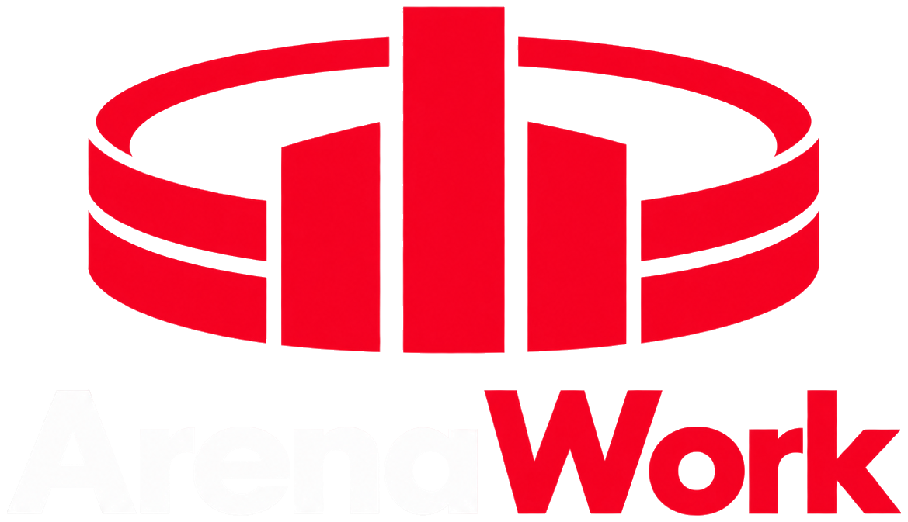
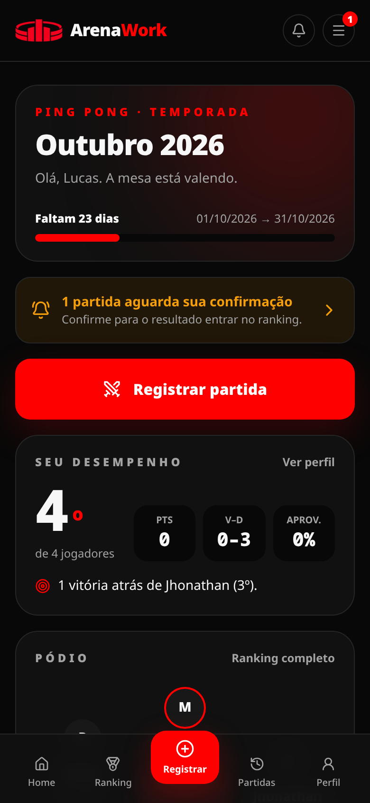
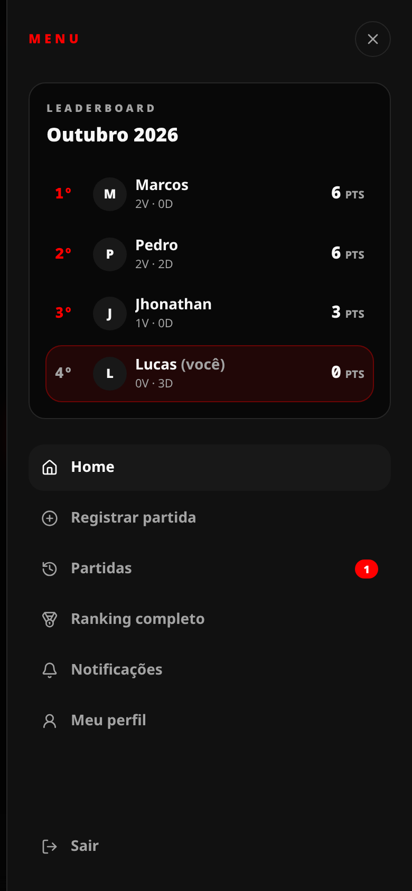
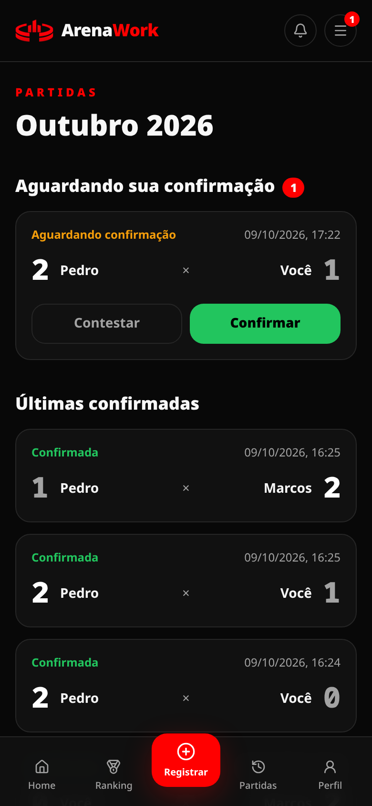
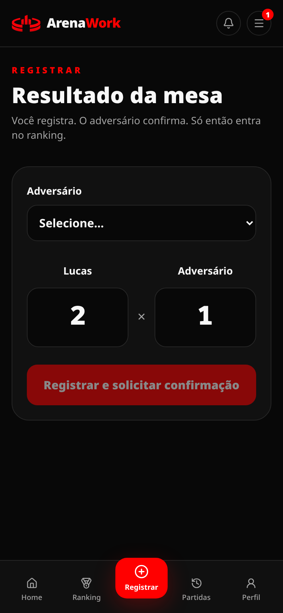
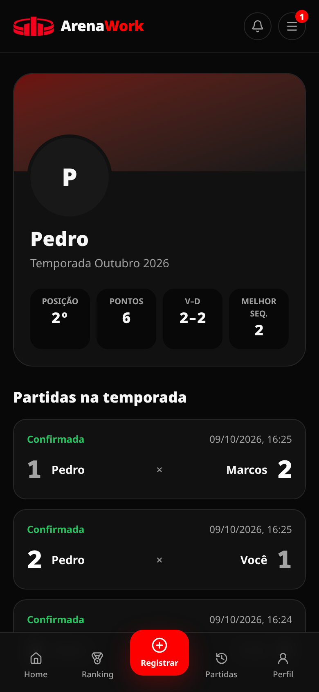
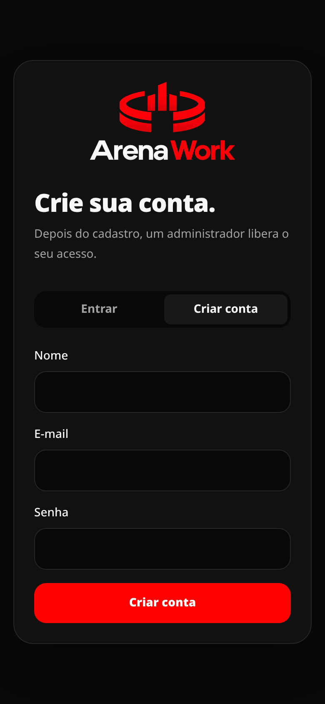
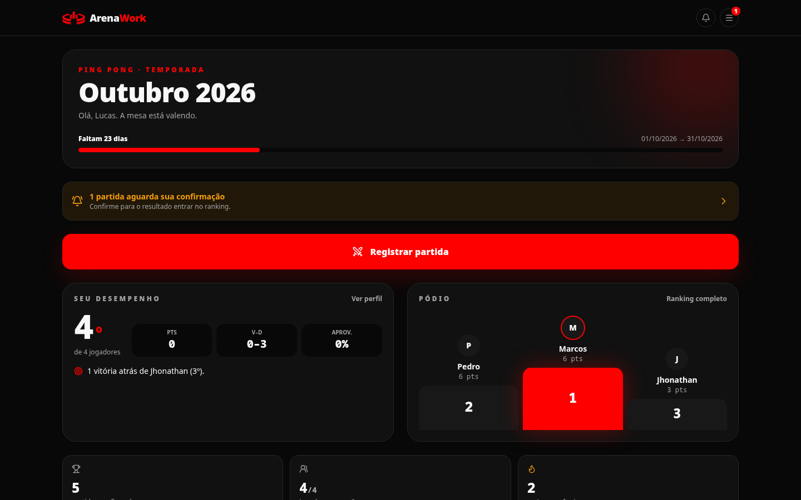
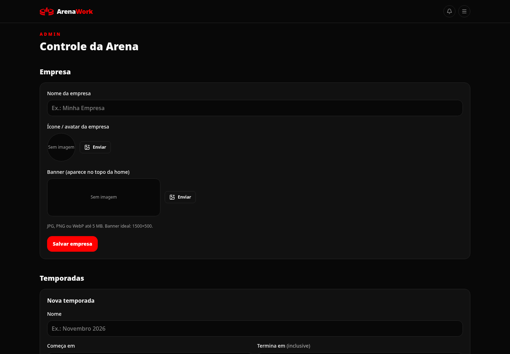
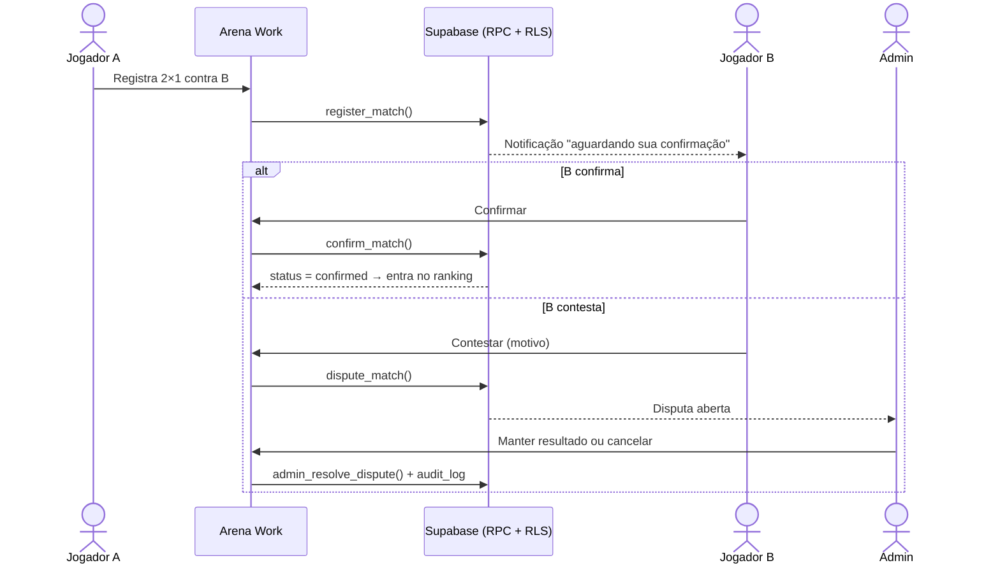

<p align="center">
  
</p>

<p align="center">
  <strong>Competições internas da sua empresa, com ranking ao vivo, temporadas e confirmação de resultado.</strong><br />
  Primeira modalidade: <strong>Ping Pong</strong>.<br /><br />
  🌐 <a href="https://arena-work.vercel.app"><strong>arena-work.vercel.app</strong></a>
</p>

<p align="center">
  
  
  
  
  
</p>

---

## Sumário

- [O que é](#o-que-é)
- [Telas](#telas)
- [Funcionalidades](#funcionalidades)
- [Como uma partida vira ranking](#como-uma-partida-vira-ranking)
- [Regras do ranking](#regras-do-ranking)
- [Stack](#stack)
- [Arquitetura](#arquitetura)
- [Segurança](#segurança)
- [Rodando localmente](#rodando-localmente)
- [Scripts](#scripts)
- [Deploy](#deploy)
- [Roadmap](#roadmap)

## O que é

O **Arena Work** é uma plataforma interna e autenticada para a empresa organizar disputas entre funcionários. Funciona assim:

1. Cada **temporada** tem data de início e de fim, definidas pelo admin.
2. Um jogador **registra** o resultado contra um colega.
3. O **adversário confirma** (ou contesta) e só então a partida entra no ranking.
4. O **ranking é calculado ao vivo** a partir das partidas confirmadas, sem pontuação editável à mão.
5. Contestações vão para o **admin**, que mantém ou cancela o resultado com registro em log de auditoria.

O app é mobile-first, tem tema escuro e pode ser personalizado com nome, ícone e banner da empresa.

## Telas

<table>
  <tr>
    <td align="center"><br /><sub><b>Home</b>: temporada, seu desempenho e pódio</sub></td>
    <td align="center"><br /><sub><b>Menu ☰</b> com leaderboard da temporada</sub></td>
    <td align="center"><br /><sub><b>Partidas</b>: confirmar ou contestar</sub></td>
  </tr>
  <tr>
    <td align="center"><br /><sub><b>Registrar</b> resultado (melhor de 3)</sub></td>
    <td align="center"><br /><sub><b>Perfil</b> com capa, foto e estatísticas</sub></td>
    <td align="center"><br /><sub><b>Criar conta</b> com aprovação do admin</sub></td>
  </tr>
</table>

**Desktop: home**



**Desktop: painel admin** (empresa, temporadas, jogadores e disputas)



## Funcionalidades

### Para os jogadores

| Recurso                   | Detalhes                                                                                                                                                                                                                  |
| ------------------------- | ------------------------------------------------------------------------------------------------------------------------------------------------------------------------------------------------------------------------- |
| **Criar conta**           | Cadastro pela tela de login. A conta nasce **inativa** até um admin aprovar.                                                                                                                                              |
| **Registrar partida**     | Escolhe o adversário e o placar: **2×0, 2×1 ou 1×0** (e invertidos). **1×1 vira empate pendente**: os dois são avisados, não conta no ranking e vocês jogam o desempate. Reenviar o mesmo registro não duplica a partida. |
| **Aceitar / recusar**     | O adversário recebe uma **notificação** e responde num **pop-up** com o placar. Só pontua se ele aceitar. **Quem recusa ganha a tag "Mal perdedor"**, visível para todos, que **só o admin remove**.                      |
| **Notificações**          | Sino com contador de não lidas, lista de atividade e "marcar todas como lidas".                                                                                                                                           |
| **Home**                  | Progresso da temporada, aviso de partidas pendentes, sua posição, distância para o próximo colocado, pódio, números da temporada e últimos jogos.                                                                         |
| **Menu ☰ / leaderboard** | Ranking completo da temporada em qualquer tela, com destaque para você.                                                                                                                                                   |
| **Perfil**                | Foto, capa, nome e estatísticas da temporada. Cada um edita só o próprio perfil.                                                                                                                                          |

### Para o admin (`/admin`)

| Recurso        | Detalhes                                                                                                                       |
| -------------- | ------------------------------------------------------------------------------------------------------------------------------ |
| **Empresa**    | Nome, ícone/avatar e banner, exibidos na home e no menu.                                                                       |
| **Temporadas** | Criar e editar escolhendo **data de início e de fim** (o último dia conta), ativar e encerrar. Só uma temporada ativa por vez. |
| **Jogadores**  | Aprovar cadastros pendentes, desativar acessos e **remover a tag "Mal perdedor"**.                                             |
| **Disputas**   | Manter o resultado contestado ou cancelar a partida.                                                                           |
| **Auditoria**  | Toda ação administrativa grava um registro em `audit_logs`.                                                                    |

## Como uma partida vira ranking



## Regras do ranking

O ranking não é armazenado: ele é **derivado das partidas confirmadas** da temporada ativa a cada leitura, o que evita bugs de sincronização. Vitória vale **3 pontos** e derrota vale 0.

Critérios de ordenação:

1. Número de vitórias
2. Aproveitamento (vitórias ÷ partidas)
3. Confronto direto entre os empatados (com 3+ empatados, vale uma mini-tabela só entre eles)
4. Menos derrotas
5. Desempate técnico determinístico

As regras puras ficam em [`src/features/ranking/domain`](src/features/ranking/domain) e têm testes unitários.

## Stack

| Camada                 | Tecnologia                                                           |
| ---------------------- | -------------------------------------------------------------------- |
| Front + servidor       | Next.js 16 (App Router, Server Components, Server Actions), React 19 |
| Linguagem              | TypeScript strict                                                    |
| Estilo                 | Tailwind CSS 4, ícones Lucide                                        |
| Formulários            | React Hook Form + Zod                                                |
| Banco, Auth e arquivos | Supabase: PostgreSQL, Auth, Row Level Security e Storage             |
| Testes                 | Vitest                                                               |
| Deploy alvo            | Vercel + Supabase                                                    |

## Arquitetura

```text
src/
├── app/                     # Rotas (App Router)
│   ├── (auth)/login         # Entrar / Criar conta
│   └── (app)/               # Área autenticada: home, ranking, partidas, perfil, admin
├── features/                # Organização por domínio
│   ├── <feature>/domain     # Regras puras em TypeScript (testáveis)
│   ├── <feature>/server     # Leituras autenticadas no servidor
│   ├── <feature>/actions    # Server Actions (mutações)
│   └── <feature>/components # UI da feature
├── components/              # Layout, marca e UI compartilhada
└── lib/                     # Supabase clients, auth guards, env, datas, storage
supabase/migrations/         # Schema, RLS, funções e buckets (SQL versionado)
tests/unit/                  # Testes de domínio
docs/                        # ADR e imagens do README
```

**Modelo de partida:** `matches → match_sides → match_participants`. Hoje cada lado tem um jogador (simples), mas o modelo já comporta duplas e times sem migração destrutiva. As decisões e trade-offs estão em [`docs/architecture.md`](docs/architecture.md).

**Fluxo de escrita:** a UI chama uma **Server Action**, que valida com Zod e chama uma **função do Postgres (RPC)**. A RPC confere identidade, papel e estado e grava tudo numa transação. O cliente nunca escreve direto nas tabelas.

## Segurança

- **RLS em todas as tabelas.** Usuários autenticados só têm permissão de leitura, e cada policy filtra o que cada um pode ver. Partidas pendentes, por exemplo, só aparecem para os participantes e para admins.
- **Escritas apenas via RPC** `SECURITY DEFINER` com `search_path` fixo. As regras são validadas no banco: sem partida contra si mesmo, só placares válidos, quem registrou não confirma, só participante confirma ou contesta, `SELECT … FOR UPDATE` contra corrida e idempotência por `request_id`.
- **Uma temporada ativa por esporte**, garantida por índice único parcial.
- **Cadastro com aprovação.** A conta nasce inativa, e um usuário inativo não lê dados nem registra partidas.
- **Storage com policies.** Cada jogador só grava na própria pasta e só admins gravam imagens da empresa. Os buckets aceitam apenas JPG/PNG/WebP até 5 MB (SVG fica de fora para evitar XSS).
- **Chave `service_role` só no servidor** (`import 'server-only'`), usada apenas no cadastro e no seed.

## Rodando localmente

### Pré-requisitos

- Node.js **22+** e npm 10+
- Um projeto no [Supabase](https://supabase.com) (ou Supabase CLI para rodar local)

### 1. Instalar

```bash
git clone git@github.com:JhonathanCosta-Dev/Arena-Work.git
cd Arena-Work
npm install
cp .env.example .env.local
```

### 2. Variáveis de ambiente (`.env.local`)

| Variável                               | Descrição                                                           |
| -------------------------------------- | ------------------------------------------------------------------- |
| `NEXT_PUBLIC_SUPABASE_URL`             | URL do projeto Supabase                                             |
| `NEXT_PUBLIC_SUPABASE_PUBLISHABLE_KEY` | Chave pública (`sb_publishable_…`)                                  |
| `SUPABASE_SERVICE_ROLE_KEY`            | Chave secreta (`sb_secret_…`). **Somente servidor, nunca commitar** |
| `NEXT_PUBLIC_APP_URL`                  | URL do app (ex.: `http://localhost:3000`)                           |
| `NEXT_PUBLIC_APP_TIMEZONE`             | Fuso das temporadas (padrão `America/Sao_Paulo`)                    |
| `SEED_CONFIRM`                         | `DEVELOPMENT_ONLY` para liberar o `npm run seed` (só em dev)        |

As chaves ficam no painel do Supabase, em **Settings → API Keys**.

### 3. Banco de dados

Aplique as migrations de [`supabase/migrations`](supabase/migrations) na ordem:

| Migration                                 | O que faz                                                               |
| ----------------------------------------- | ----------------------------------------------------------------------- |
| `202610080001_initial_schema`             | Tabelas, enums, RLS, RPCs de partida e o esporte Ping Pong              |
| `202610080002_admin_seasons_and_disputes` | RPCs de admin para temporada e disputas                                 |
| `202610090001_hardening`                  | Revisão de permissões e índices de chaves estrangeiras                  |
| `202610090002_admin_panel_and_signup`     | Painel admin (temporadas com datas, aprovação) e cadastro pendente      |
| `202610090003_company_and_media`          | Empresa (nome/ícone/banner), avatares e buckets do Storage              |
| `202610090004_bad_loser_tag`              | Tag "Mal perdedor" ao recusar, remoção só por admin, notificações lidas |
| `202610090005_match_status_drawn`         | Novo status `drawn` (empate)                                            |
| `202610090006_single_game_and_draws`      | Placar 1×0 e empate 1×1 avisando os dois jogadores                      |
| `202610090007_season_window_errors`       | Mensagens claras para temporada não iniciada ou encerrada               |

Com a Supabase CLI:

```bash
supabase link --project-ref SEU_PROJECT_REF
supabase db push
```

> Recomendado: em **Authentication → Sign In / Providers**, desligue _"Allow new users to sign up"_. O cadastro do app usa a Admin API no servidor e continua funcionando, e isso fecha o cadastro direto pela API pública.

### 4. Dados de desenvolvimento (opcional)

```bash
npm run seed
```

Cria 4 jogadores, uma temporada ativa de exemplo (Outubro 2026, ajuste as datas no painel admin) e algumas partidas confirmadas. Todos usam a senha `ArenaDev123!`:

| E-mail                  | Papel                                  |
| ----------------------- | -------------------------------------- |
| `jhonathan@arena.local` | jogador (promova a admin, veja abaixo) |
| `pedro@arena.local`     | jogador                                |
| `lucas@arena.local`     | jogador                                |
| `marcos@arena.local`    | jogador                                |

Para tornar alguém admin, rode no SQL Editor do Supabase:

```sql
update public.profiles set role = 'admin' where email = 'jhonathan@arena.local';
```

> O seed é protegido por `SEED_CONFIRM` e **nunca** deve rodar em produção.

### 5. Subir o app

```bash
npm run dev
```

Abra <http://localhost:3000>.

## Scripts

| Comando                       | Descrição                         |
| ----------------------------- | --------------------------------- |
| `npm run dev`                 | Servidor de desenvolvimento       |
| `npm run build` / `npm start` | Build e servidor de produção      |
| `npm run lint`                | ESLint (zero warnings)            |
| `npm run typecheck`           | Checagem de tipos                 |
| `npm test`                    | Testes unitários (Vitest)         |
| `npm run format`              | Prettier                          |
| `npm run verify`              | lint + typecheck + testes + build |
| `npm run seed`                | Dados de desenvolvimento          |

## Deploy

- **Produção:** <https://arena-work.vercel.app>, com deploy automático a cada push na `main`.
- **Front:** Vercel, configurando as mesmas variáveis de ambiente. `SUPABASE_SERVICE_ROLE_KEY` não pode ter prefixo `NEXT_PUBLIC_`.
- **Banco, Auth e Storage:** Supabase, com as migrations aplicadas.
- Ajuste `NEXT_PUBLIC_APP_URL` para o domínio final.

## Roadmap

- [x] Schema, RLS, autenticação e ranking derivado
- [x] Registrar, confirmar e contestar partidas
- [x] Home com desempenho pessoal, pódio e últimos jogos
- [x] Menu com leaderboard da temporada
- [x] Painel admin: temporadas com datas, aprovação de jogadores e disputas
- [x] Perfil da empresa e imagens de perfil
- [ ] Encerramento de temporada com snapshot final e **Hall da Fama**
- [ ] Corrigir placar ao resolver disputa (o banco já suporta)
- [x] Notificações com pop-up para aceitar/recusar e tag "Mal perdedor"
- [x] Placar de jogo único (1×0) e empate pendente (1×1)
- [ ] Confronto direto entre jogadores no perfil
- [ ] Testes de RLS (pgTAP) e de ponta a ponta
- [ ] Limite de tentativas no cadastro
